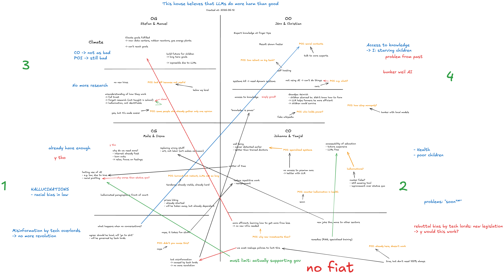

# Debate

After Friday's "Coding is sexy but debating is S.EX.I.E.R." session, many people were interested in having a real debate. So we had one on Saturday. We debated in British Parliamentary (BP) style but speech times were cut in half (3.5 minutes instead of 7 minutes) to a) make it more suitable for beginners and b) fit the schedule.

## Motion

> This House believes that LLMs do more harm than good.

## Jury Notes
The jury notes are available as an editable [Excalidraw](https://excalidraw.com/) file [here](./jury-notes.excalidraw). The PNG version is here:

> [!NOTE]
> The jury notes and the jury's decision is sadly not objective as everybody understands things differently, prioritizes things differently, and ultimately thinks differently. But these notes are the best thing there is to give you an impression of what the debate was about.

> [!NOTE]
> Color coding (which I didn't adhere to 100%, sorry):
> - Black: Things that the speaker said
> - Orange: POIs (Points of Information) that the speaker accepted, i.e. questions from the other side of the debate
> - Red & Green: My personal thoughts on certain arguments
> The notes in bigger font at the side are my summary of each team's contribution to the debate

